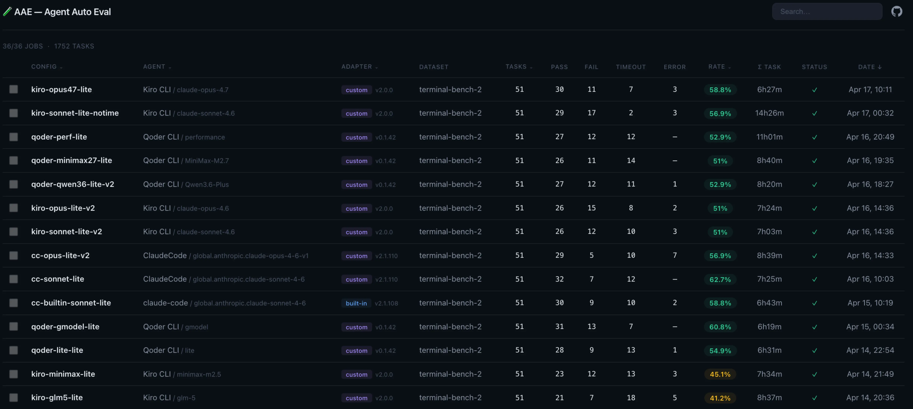

# Kiro CLI Benchmark Report — Terminal-Bench 2.0

## 什么是 Terminal-Bench

[Terminal-Bench](https://www.tbench.ai/) 是一个评估 AI coding agent 在真实终端环境中解决任务能力的 benchmark。每个任务包含：

- **Docker 容器**：预配置的开发环境（特定语言、工具链、依赖）
- **任务指令**：自然语言描述的编程任务（修 bug、编译项目、配置服务、数据处理等）
- **Pytest 验证**：自动化测试脚本，判定任务是否完成

Agent 被放入容器中，只能通过终端命令（bash、文件读写、代码编辑）完成任务，不能看到测试代码。每个任务有 timeout 限制（本次测试为 15 分钟），超时即判定失败。

Terminal-Bench 2.0 包含 89 个任务，涵盖系统运维、编译构建、数据处理、密码学、机器学习等多个领域。本次测试使用 **Lite 子集（51 个任务）**，筛选条件为 agent timeout ≤ 15 分钟，覆盖了大部分 easy 和 medium 难度的任务。

## 测试目标

评估 Kiro CLI 在 Terminal-Bench 上的表现，分析不同模型的效果差异，并与 Claude Code、Qoder CLI 进行横向对比，找出 Kiro 的优势、瓶颈和改进方向。

## 测试环境

- **框架**: [Harbor](https://github.com/harbor-ai/harbor)（Terminal-Bench 2.0 执行层）
- **数据集**: `terminal-bench/terminal-bench-2` Lite（51 tasks）
- **EC2**: m7a.8xlarge（32 vCPU, 128GB RAM），ap-northeast-1
- **Kiro CLI**: v2.0.0，API key 认证
- **Claude Code**: v2.1.108，Bedrock API（us-east-1）
- **Qoder CLI**: v0.1.42，API token 认证
- **测试时间**: 2026-04-14 ~ 2026-04-17
- **Dashboard**: http://13.114.48.122:8080



所有测试使用统一的 system prompt（详见附录）。

---

## 一、Kiro CLI 模型对比

### 总览

| Model | Pass/51 | Rate | Timeout | Error | Σ Task Time | Credits | cr/task |
|-------|---------|------|---------|-------|-------------|---------|---------|
| Sonnet 4.6 (10x timeout) | **29** | **56.9%** | 2 | 3 | 14h26m | 267 cr | 9.2 |
| Opus 4.6 | 27 | 52.9% | 9 | 2 | 5h21m | 112 cr | 4.1 |
| Sonnet 4.6 | 26 | 51.0% | 10 | 3 | 7h03m | 46 cr | **1.8** |
| MiniMax M2.5 | 23 | 45.1% | 13 | 3 | 7h34m | 45 cr | 2.0 |
| GLM-5 | 21 | 41.2% | 18 | 5 | 8h37m | 76 cr | 3.6 |

### 分析

**Sonnet 4.6 是性价比最优选择。** 46 credits 通过 26 个任务（1.8 cr/task），放宽 timeout 后可达 29 个（56.9%）。

**Opus 4.6 比 Sonnet 高 2 个百分点，但 credits 翻倍。** Opus 在 5 个任务上比 Sonnet 强（fix-code-vulnerability, largest-eigenval, password-recovery, regex-log, sparql-university），但也在 5 个任务上不如 Sonnet（adaptive-rejection-sampler, cancel-async-tasks, configure-git-webserver, git-leak-recovery, openssl-selfsigned-cert）。两者各有胜负，Opus 并非全面优于 Sonnet。

**MiniMax 和 GLM-5 的瓶颈是速度和 token 消耗。** GLM-5 有 18 个 timeout（占 35%），MiniMax 有 13 个。原因可能有两方面：一是模型推理速度本身较慢，二是模型在解题过程中调用轮次更多、消耗更多 token，间接拉长了总耗时。

**GLM-5 的成本异常偏高。** GLM-5 消耗 76 credits 却只通过 21 个任务（3.6 cr/task），是 Sonnet 的 2 倍成本但通过率低 10 个百分点。这说明 GLM-5 在任务上花费了大量无效的探索和重试，性价比最差。

**非 Claude 系列模型推荐 MiniMax M2.5。** 在 Claude 系列之外的模型中，MiniMax M2.5 以 45 credits 通过 23 个任务（2.0 cr/task），成本与 Sonnet 持平但通过率低 6 个百分点。综合考虑成本和效果，MiniMax M2.5 是非 Claude 模型中的最优选择。

**Kiro 的真实能力被 timeout 压低了约 6 个百分点。** 放宽 timeout 10 倍后，5 个原本超时的任务成功通过（crack-7z-hash, largest-eigenval, password-recovery, pytorch-model-recovery, fix-code-vulnerability）。

---

## 二、Kiro vs Claude Code

### 总览

| Agent | Model | Pass/51 | Rate | Timeout | Cost |
|-------|-------|---------|------|---------|------|
| CC (Bedrock) | Sonnet 4.6 | **32** | **62.7%** | 12 | $15.50 |
| CC (Bedrock) | Opus 4.6 | 29 | 56.9% | 10 | 未统计 |
| Kiro | Opus 4.6 | 27 | 52.9% | 9 | 112 cr |
| Kiro | Sonnet 4.6 | 26 | 51.0% | 10 | 46 cr |

### 差距分析

CC 和 Kiro 都通过 Bedrock 调用相同的 Sonnet 4.6 模型，底层 API 调用速度没有本质差别。但 CC 通过率高出 11.7 个百分点。

CC 独有通过 7 个任务，Kiro 独有通过 4 个任务，两者共同通过 25 个任务。从任务类型看：

- **CC 的优势集中在系统运维和文本处理类任务**（regex-log, sanitize-git-repo, git-multibranch, sqlite-with-gcov 等），这类任务需要快速执行多步 shell 命令并根据输出调整策略，CC 的 agent loop 在这方面决策更高效。
- **Kiro 的优势集中在调试调优类任务**（pytorch-model-recovery, tune-mjcf, largest-eigenval 等），这类任务需要反复修改参数、观察结果、逐步逼近正确答案，Kiro 在迭代式问题解决上表现更好。

差距可能来自：
- **Agent 策略差异**：CC 的 agent loop 在多步系统操作类任务上决策更高效，而 Kiro 在需要深度调试的任务上更有耐心。

### Kiro 的优势

- **成本**：Kiro Sonnet 跑 51 个任务消耗 46 credits，CC 消耗 $15.50。Kiro 成本显著更低。
- **调试调优类任务**：Kiro 在需要反复迭代和参数调整的任务上有独特优势。

---

## 三、Kiro vs Qoder

### 总览

| Agent | Best Model | Pass/51 | Rate | Timeout |
|-------|-----------|---------|------|---------|
| Qoder | GLM-5 | **31** | **60.8%** | 7 |
| Qoder | lite | 28 | 54.9% | 13 |
| Qoder | Qwen3.6-Plus | 27 | 52.9% | 11 |
| Qoder | performance | 27 | 52.9% | 12 |
| Qoder | MiniMax-M2.7 | 26 | 51.0% | 14 |
| Kiro | Opus 4.6 | 27 | 52.9% | 9 |
| Kiro | Sonnet 4.6 | 26 | 51.0% | 10 |
| Kiro | MiniMax M2.5 | 23 | 45.1% | 13 |
| Kiro | GLM-5 | 21 | 41.2% | 18 |

### 差距分析

Qoder 的最佳成绩（GLM-5, 60.8%）高于 Kiro 的最佳成绩（Opus 4.6, 52.9%）。

**相同 GLM-5 模型下的差距尤为明显。** Qoder + GLM-5 通过 31/51（60.8%），Kiro + GLM-5 仅通过 21/51（41.2%），差距近 20 个百分点。虽然两者都使用 GLM-5 模型，但通过不同的 provider 接入，模型版本、推理配置、上下文处理等可能存在差异。此外，agent 层面的 orchestration 效率也是重要因素 — Kiro + GLM-5 的 timeout 数高达 18 个（Qoder 仅 7 个），说明 Kiro 在对接 GLM-5 时整体执行效率明显低于 Qoder。

总体来看，Qoder 在 Terminal-Bench 上的表现明显优于 Kiro，各模型通过率普遍高出 5-20 个百分点。这可能与 Qoder 针对 Terminal-Bench 类任务做了针对性的 agent 策略调优有关。

---

## 四、Kiro 擅长与不擅长的任务

### Kiro 擅长的任务类型

基于 19 个稳定通过的任务分析：

- **编译构建**：build-cython-ext, build-pmars — 能正确处理编译错误和依赖问题
- **代码迁移/现代化**：cobol-modernization, modernize-scientific-stack — 理解旧代码并正确重构
- **Git 操作**：fix-git, prove-plus-comm — 熟练使用 git 命令
- **服务配置**：nginx-request-logging, pypi-server, kv-store-grpc — 能配置和启动服务
- **数据处理**：multi-source-data-merger, sqlite-db-truncate, query-optimize — SQL 和数据操作
- **调试调优**：pytorch-model-cli, tune-mjcf, hf-model-inference — 参数调整和模型调试

### Kiro 不擅长的任务类型

基于 17 个始终失败的任务分析：

- **底层系统编程**：polyglot-c-py, polyglot-rust-c, torch-pipeline-parallelism — 需要深入理解多语言 FFI 和并行计算
- **算法密集型**：chess-best-move, write-compressor, gpt2-codegolf — 需要复杂算法设计
- **虚拟化相关**：qemu-alpine-ssh, qemu-startup — 容器环境限制（无 KVM），所有 agent 均失败，非 Kiro 自身问题
- **长时间任务**：make-doom-for-mips, raman-fitting — 即使放宽 timeout 也难以完成

---

## 总结与建议

### 总结

Kiro CLI 在 Terminal-Bench 2.0 Lite（51 个任务）上使用 Sonnet 4.6 取得 **51.0% 的通过率**，使用 Opus 4.6 可达 **52.9%**。在三个 agent 中，Kiro 的通过率低于 Claude Code（62.7%）和 Qoder（60.8%），但在成本上有明显优势（46 credits vs CC 的 $15.50）。

Kiro 的核心瓶颈在于 **agent 策略效率**：与 CC 使用相同的 Sonnet 4.6 模型（均通过 Bedrock 调用），通过率差 12 个百分点；与 Qoder 使用相同的 GLM-5 模型，通过率差 20 个百分点。差距主要体现在 timeout 数量上 — Kiro 有更多任务因超时而失败。

Kiro 在**调试调优类任务**上有独特优势，在**编译构建、代码迁移、服务配置**等常见开发任务上表现稳定。不擅长的领域集中在底层系统编程和算法密集型任务，但这些任务对所有 agent 都是挑战。

在开源/第三方模型方面，**MiniMax M2.5 是 Kiro 上非 Claude 系列的最优选择**（45 cr, 45.1%），成本与 Sonnet 持平。GLM-5 虽然在 Qoder 上表现出色（60.8%），但在 Kiro 上效果不佳（41.2%），且成本异常偏高（76 cr），不推荐在 Kiro 上使用。两个模型在 Kiro 和 Qoder 上的表现差异较大，说明开源模型的效果高度依赖 agent 的适配和调优。

### 建议

1. **优化 Agent 策略** — Kiro 与 CC 使用相同的底层模型，但通过率差 12 个百分点。差距来自 agent 层面（工具选择、错误恢复、任务规划），而非模型能力。优化 agent loop 的决策效率是缩小差距的关键。

2. **第三方模型的成本和速度优化** — Kiro 接入的 GLM-5、MiniMax 等第三方模型存在 timeout 偏高、credits 消耗异常等问题（如 GLM-5 消耗 76 credits 但通过率仅 41.2%）。建议针对第三方模型优化调用链路的响应速度和 token 消耗效率，减少无效轮次。

3. **execute_bash 权限** — Kiro 2.0.0 在 `--no-interactive` 模式下拒绝 `execute_bash`，需要通过自定义 agent config 的 `allowedTools: ["*"]` 绕过。建议提供更直接的方式（如环境变量或 CLI flag）。

---

## 附录

### System Prompt

所有测试使用统一的 system prompt：

```
You are an autonomous coding agent. Follow these rules strictly:
- Execute the task completely without asking any questions
- Make all decisions yourself (choose defaults when not specified)
- Never ask for clarification, paths, or preferences
- If a directory or file location is not specified, explore the filesystem to find it
- Try multiple approaches if the first one fails
- Verify your work before finishing
```

### 测试框架

测试通过 [AAE (Agent Auto Eval)](https://github.com/vokako/auto-agent-eval) 框架调度，使用 Harbor 作为执行层，每个任务在独立的 Docker 容器中运行。
